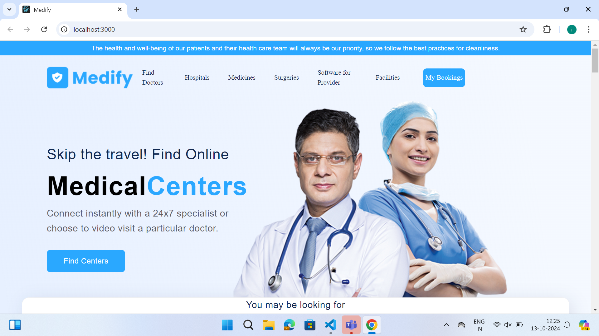

<<<<<<< HEAD
# Medify_Takehome

## MEDIFY - Medical Center Slot Booking Platform

=======
# MEDIFY - Medical Center Slot Booking Platform
>>>>>>> a43c1971313ee7c12680b47fbe49a0e908ef19b8
## The App

**Code-A-Thon Project:** A React-based web application that allows users to find medical centers in specific states and cities across the USA and book appointments.

<<<<<<< HEAD
## Features

=======
## Features:
>>>>>>> a43c1971313ee7c12680b47fbe49a0e908ef19b8
- **Landing Page:**

  - The app has a top navigation bar with access to sections such as Find Doctors, Hospitals, Medicines, and more.
  - It includes a search section for users to select a state and city, leading to a list of available medical centers in the chosen area.
  - Both State and City have dropdowns populated by an API.

- **Search Results Page:**

  - The search results page displays a listing of available medical centers in the selected location, with the option to book appointments.

- **Booking Interface:**

  - The app provides a detailed booking section where users can select a medical center and choose an appointment date using a calendar-like interface.
  - Users can book an appointment within a time frame from today up to one week in advance.
  - The booking interface displays available time slots for the selected day.

- **My Bookings Page:**

  - The My Bookings page is personalized and displays all user bookings, including details such as the medical center's name, appointment date, and time.

- **Responsive Design:**
  - The application is fully responsive, adapting to various screen sizes.

## Technologies Used

- `HTML`
- `CSS`
- `JavaScript`
- `React.js`
- `React Router DOM`

## NPM Libraries Used

- `Swiper`
- `Material UI`
- `Axios`

<<<<<<< HEAD
## Demo

- [Click here for the demo](https://medify-takehome-feoxtz8xx-indra-reddys-projects.vercel.app/)
=======
`SWIPER`
`MATERIAL UI`
`Axios`
>>>>>>> a43c1971313ee7c12680b47fbe49a0e908ef19b8
